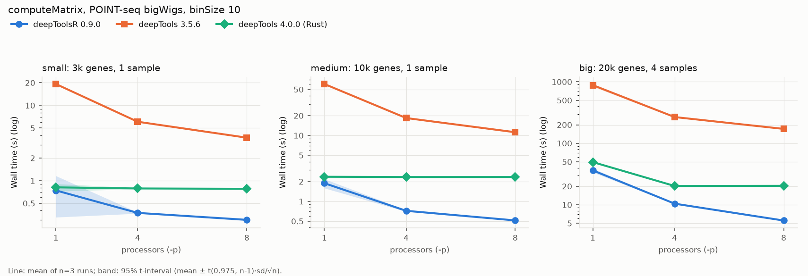
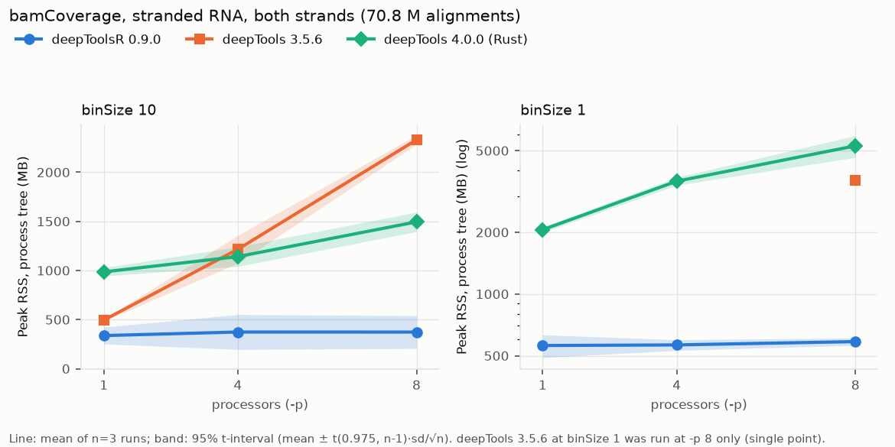
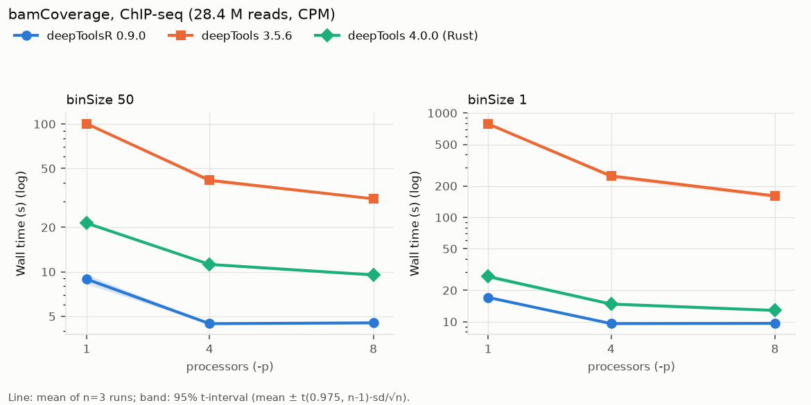

# deepToolsR

deepToolsR is a C++-accelerated reimplementation of selected
[deepTools](https://github.com/deeptools/deepTools) 3.5.6 tools for analysing
and plotting high-throughput sequencing data. Matrix computation, statistics,
coverage, bigWig I/O, clustering and heatmap rasterisation run in native
extensions; the command-line programs are provided by the Python package
`deeptoolsr`. Commands carry an `R` suffix (for <u>R</u>NA) because it was made 
with RNA-seq in mind, and so they can be installed beside the originals.

| Command                        | Purpose                                                                 |
| ------------------------------ | ----------------------------------------------------------------------- |
| `bamCoverageR`                 | coverage tracks (bigWig/bedGraph) from BAM files                        |
| `bigWigOperationsR`            | `info`, `scale` and `merge` for bigWig tracks                           |
| `computeMatrixR`               | signal matrices around genomic regions                                  |
| `computeMatrixOperationsR`     | inspect and transform saved matrices                                    |
| `plotMatrixR`                  | profiles, heatmaps or both from one matrix                              |
| `plotHeatmapR`, `plotProfileR` | deepTools-style front ends to the same plot engine                      |
| `deeptoolsr`                   | list commands, configure options, `describe` and `serve` for front ends |

## Install

Python 3.11 or newer is required. From a source checkout:

```sh
python -m pip install .
```

Or directly from github:

```sh
python -m pip install git+https://github.com/krystianll/deepToolsR.git@main
```

The native extensions are built during installation (htslib and the other
bundled libraries are compiled from source on every platform). You need:

- CMake, a C/C++17 compiler, make and zlib development headers;
- on Linux and macOS, the autotools needed to configure htslib;
- on Windows, an MSYS2 MinGW toolchain (CLANGARM64 or UCRT64 environment)
  with the regex/tre packages.

## Quick start

```sh
# coverage track, CPM-normalised
bamCoverageR -b sample.bam -o sample.bw --normalizeUsing CPM -p max

# signal around TSSs
computeMatrixR reference-point -S sample.bw -R genes.bed -b 3000 -a 3000 \
    -o matrix.gz -p max

# plots: heatmap + profile in one figure, or the deepTools-style front ends
plotMatrixR -m matrix.gz --profile --heatmap -o figure.pdf
plotHeatmapR -m matrix.gz -o heatmap.png
plotProfileR -m matrix.gz -o profile.png
```

Every command accepts `--help`.

## Changes vs deepTools 3.5.6

**Performance and native core**

- Native (C++ as the backend) computeMatrix, bamCoverage, bigWig reading/writing,
  statistics, clustering and heatmap rasterisation, with multicore execution and
  bounded memory. 
- Optimised to keep memory use low.
- Bundled htslib and libBigWig replace pysam/pyBigWig at run time.

**New tools and options**

- `plotMatrixR` is the unified command to plot profiles, heatmaps or both using a new unified collision-aware plotting engine. The new grid system enables custom sample/region group arrangement. `plotProfileR` and `plotHeatmapR` are also available for compatibility.
- Also in plotting: `--axisVisibility`, `--commonLegend`, `--distanceUnit` and `--distanceUnitLocation`, `--showRegionCounts`, `--aspectRatio`, geometric and trimmed means for profile trace, confidence intervals and bootstrap, `--sortIndicator`, `--zMid`, `--quantiles` and more.
- `bigWigOperationsR`: scaling and merging bigWig files.
- `bamCoverageR`: `--normalizeUsing coverage-mean|coverage-sum|read-count`,
  `--strandedness` (including inference), `--collapse`, whitelists and
  `--filterByOverlap`, `--filterMode`, `--zoomLevels`, `--compressionLevel`.
- `computeMatrixR`: paired minus-strand bigWigs (`--scoreFileNameMinus`),
  `--antisense`, `--unstranded`, strand multipliers, `--quantileSortedRegions`.
- `computeMatrixOperationsR`: `reorder`, `rbind`/`cbind --blind`,
  `--sameGroupLabels`, richer `filterValues`, `info --json`.
- `--config PATH|auto` and `-p N|max|auto` on every command; persistent
  typography and geometry settings ([PLOTTING_STYLE.md](PLOTTING_STYLE.md)).
- `deeptoolsr describe` (plot metadata as JSON) and `deeptoolsr serve` (a
  persistent JSON-lines plotting worker) for GUI and other front ends.

**Changed defaults and behaviour**

- Plot tools default to `--sortRegions ascend` and `--yAxisLimits per_y_label`
  (deepTools plotHeatmap sorted `descend`).
- Plot tools no longer re-filter rows by the matrix header's
  `min threshold`/`max threshold`; computeMatrixR applies those filters.
- Explicit per-sample and per-group assignments use `N=value`.
- `bamCoverageR` excludes secondary and supplementary alignments by default
  (`--filterMode deeptools` restores the stock policy); normalised tracks use a
  shared library-size denominator by default.
- Figures are laid out by one grid solver with named gaps; one cell width
  (`--cellWidth` in plotMatrixR, `--heatmapWidth`/`--plotWidth` in the
  deepTools-style tools) sizes all panels consistently, so figure dimensions
  differ from deepTools.
- Minimum Python is 3.11.

**Safety**

- Extensive input checks and more informative error messages.
- deepToolsR writes to temporary files first so that a failed command does not delete your previous to-be-overwritten files.

**Removed**

- Commands other than those listed above; Plotly output.
- RPGC normalisation and `--effectiveGenomeSize`; `--averageTypeBins std`;
  `overlapped_lines` profile type; the inherited `--smartLabels`,
  `--startLabel`, `--endLabel` of computeMatrix.
- bamCoverageR: `--region`, `--smoothLength`, `--skipNonCoveredRegions`
  (`--skipNAs`), `--samExcludeFlag`, `--centerReads`, `--verbose` and
  `--normalizeUsing None`.
- plotProfileR: `--numPlotsPerRow` (use `--gridColumns`/`--gridRows`);
  plotHeatmapR: fewer `--whatToShow` choices (see CHANGES.txt).

**Output differences**

- K-means clustering uses a fixed seeded native generator and Ward uses
  fastcluster, so memberships may differ from SciPy.
- Automatic heatmap colour limits use a t-digest algorithm for fast and memory-bound quantiles; confidence-interval quantiles come from vendored Cephes code
  (differences within 1e-12 relative).
- Compressed matrices, PDF and SVG output are byte-reproducible (no timestamps).
- Plain-text matrix operations keep the input's numeric tokens; matrix headers
  record the resolved thread count and the sort actually applied.

## Benchmarks

deepToolsR 0.9.0 was compared with deepTools 3.5.6 (Python) and deepTools 4.0.0
(Rust core) on an Apple M4 Pro (14 cores, 48 GB RAM, macOS 27.0.1, arm64).
Every case was run 3 times; the tables give the median.

Data: ChIP-seq is ENCODE HCT116 H3K4me3
([ENCFF772IUE](https://www.encodeproject.org/files/ENCFF772IUE/), ENCSR333OPW
replicate 1; GRCh38, single-end, 28,418,040 mapped reads). RNA and computeMatrix
inputs are unpublished POINT-seq (nascent RNA) data from HCT116: paired-end,
70.8 M alignments for RNA, and binSize 1 sense-strand bigWigs for 4 conditions
for the matrices. Regions are 20,107 GENCODE v50 protein-coding genes. No data
is included in the repository.

| Case                                                                      | deepToolsR          | deepTools 3.5.6 | deepTools 4.0.0 |
| ------------------------------------------------------------------------- | -------------------:| ---------------:| ---------------:|
| bamCoverage, ChIP, binSize 1, `-p 8`                                      | **9.6 s / 424 MB**  | 161 s / 3.5 GB  | 12.9 s / 5.4 GB |
| bamCoverage, ChIP, binSize 1, `-p 1`                                      | **17.1 s / 397 MB** | 786 s / 872 MB  | 26.9 s / 2.0 GB |
| Stranded RNA, both strands, binSize 1, `-p 8`                             | **16.2 s / 582 MB** | 496 s / 3.6 GB  | 30.8 s / 5.3 GB |
| computeMatrix, 20k genes x 4 samples, `-p 8`                              | **5.5 s / 878 MB**  | 171 s / 3.6 GB  | 20.3 s / 1.6 GB |
| computeMatrix, stranded, same size, `-p 8`                                | **6.2 s / 963 MB**  | 236 s / 3.0 GB  | 82.0 s / 1.7 GB |
| plotHeatmap, 20k genes x 4 samples, `-p 1` (deepTools is single-threaded) | **5.8 s / 680 MB**  | 12.7 s / 4.2 GB | 9.8 s / 4.2 GB  |
| plotHeatmap, same matrix, deepToolsR `-p 8`                               | **2.2 s / 910 MB**  | 12.7 s / 4.2 GB | 9.8 s / 4.2 GB  |

Wall time / peak RSS. For both-strand RNA and stranded matrices, deepToolsR
needs one run; 3.5.6 and 4.0.0 need two runs (RNA) or three commands
(computeMatrix plus `computeMatrixOperations rbind`), and their times are the sums. Peak RSS
covers the whole process tree; for 3.5.6, whose worker processes share memory,
it is an upper bound.







Output parity: RNA coverage is identical to both deepTools 3.5.6 and 4.0.0.
Matrices are identical to 4.0.0, which also stores 32-bit floats and places
bin edges exactly. Against 3.5.6, matrices differ by float32 rounding and, in
scale-regions matrices, at the few bin edges that 3.5.6 places 1 bp early (see
CHANGES.txt).

See [benchmarks/release/RESULTS.md](benchmarks/release/RESULTS.md) for the
method, confidence intervals, all cases and how to reproduce them.

## More documentation

- [CHANGES.txt](CHANGES.txt): release notes and the deepTools history
- [KNOWN_ISSUES.md](KNOWN_ISSUES.md): known plotting-layout issues
- [PLOTTING_STYLE.md](PLOTTING_STYLE.md): fonts, geometry and `options.txt`

## Licence and credits

deepToolsR is derived from deepTools by the Max Planck Institute for
Immunobiology and Epigenetics and its contributors, and is released under the
MIT licence (`LICENSE.txt`).
Licences of bundled third-party components (htslib, libBigWig, libdeflate,
fastcluster, fast_float, SciPy/Cephes, digestible, stb and others) are in
[LICENSES/](LICENSES/README.md).

## Citation

Please cite deepTools: Ramírez F, Ryan DP, Grüning B, et al. deepTools2: a next
generation web server for deep-sequencing data analysis. *Nucleic Acids
Research* 2016; doi:[10.1093/nar/gkw257](https://doi.org/10.1093/nar/gkw257),
and this repository (https://github.com/krystianll/deepToolsR).
